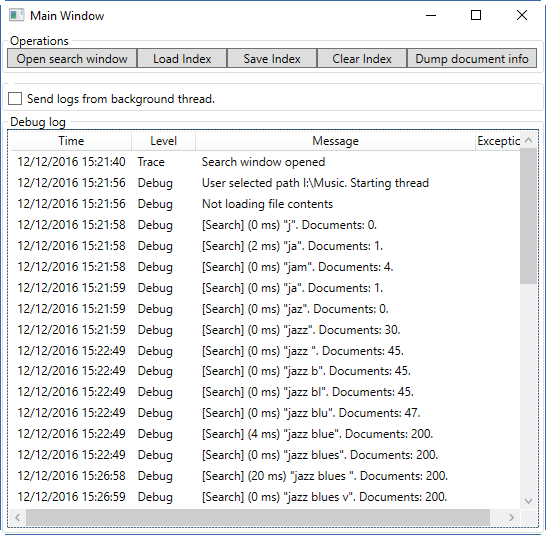
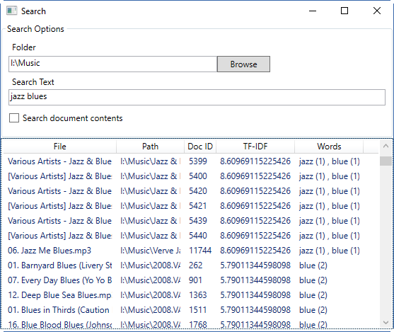

# search-indexer
File search engine. Uses inverted indexes &amp; stemming. 

Using the Model-view-viewmodel (MvvM) software development methodology.

Logs to a graphical user interface NLogViewer and to a log file.

#### Previews

